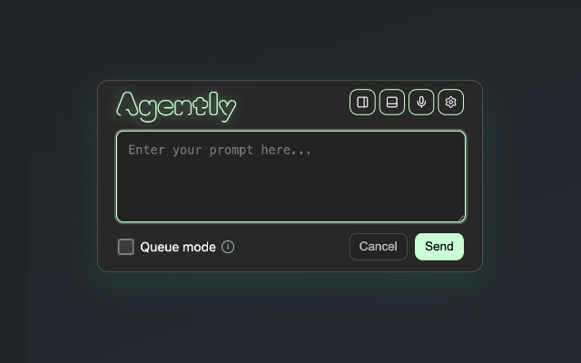

# Agently VS Code Extension

Agently connects your browser to VS Code so you can send a prompt from a live page together with DOM context.

It is designed to work with the Agently Chrome extension. When you trigger a prompt in Chrome, this extension receives it through a local HTTP bridge, shows it in a prompt queue, and sends it to Copilot Chat in VS Code.

<a href="https://chromewebstore.google.com/detail/agently-local-prompt-to-l/cdcngpbohinmfhnpnilaijkkdloiokcl">
  &nbsp;&nbsp;Available on Chrome Web Store

</a>

## Requirements

- VS Code `1.95.0` or newer
- The Agently Chrome extension
- GitHub Copilot Chat installed and enabled in VS Code

## How It Works

1. Open your app locally in Chrome.
2. Use the Agently Chrome extension on the page you are testing.
3. Enter a prompt and send it from Chrome.
4. The Agently VS Code extension receives the prompt over a local bridge on `127.0.0.1:43110` by default.
5. The prompt is added to the Agently prompt queue and then sent to Copilot Chat in VS Code.

Agently includes page context with the prompt, such as the page URL and DOM selector for the element you targeted. This helps you work from the live UI without first tracking down the exact component manually.

## Installation

1. Install the [Agently Chrome extension](https://chromewebstore.google.com/detail/agently-local-prompt-to-l/cdcngpbohinmfhnpnilaijkkdloiokcl).
2. Install this VS Code extension.
3. Make sure GitHub Copilot Chat is installed and enabled.

## Usage

1. Start your local app in development mode, for example with `npm run dev` or `npm run start`.
2. In VS Code, run **Agently: Open Prompt Panel** from the Command Palette.
3. In Chrome, open your local app and use the Agently extension.
4. Trigger the prompt flow from the page, enter your request, and send it.
5. The prompt appears in the Agently queue and is automatically sent to Copilot Chat when the queue was previously empty.
6. If additional prompts are queued, run **Agently: Apply Next Queued Prompt** or use the play button in the prompt panel to send the next one.

## Features

- **Local HTTP bridge**: Receives prompt payloads from the Chrome extension on a configurable localhost port.
- **Prompt queue panel**: Shows incoming prompts, source information, and DOM context.
- **Copilot Chat handoff**: Opens Copilot Chat in VS Code and forwards the queued prompt.
- **Manual queue control**: Lets you run the next queued prompt from a command or directly from the panel.

## Commands

- `Agently: Open Prompt Panel`
- `Agently: Apply Next Queued Prompt`
- `Agently: Open Settings`

## Configuration

You can customize the following settings in VS Code:

- `agently.bridgePort`: Local HTTP port used by browser integrations to send prompt payloads. Default: `43110`
- `agently.autoOpenPanelOnPrompt`: Automatically opens the Agently panel when a new prompt arrives. Default: `true`
- `agently.showNotifications`: Shows VS Code information notifications for Agently events. Default: `false`

## Notes

- The local bridge listens on `127.0.0.1`, not on your public network interface.
- If Copilot Chat is unavailable, Agently cannot submit prompts automatically.
- If the prompt panel is already open, you can run queued prompts from the play button beside each item.
